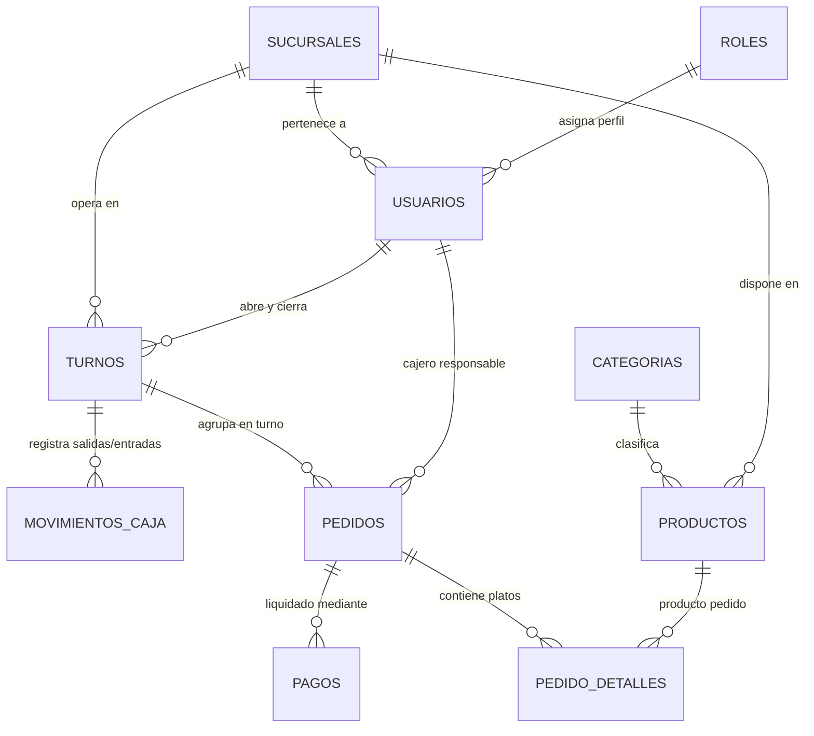
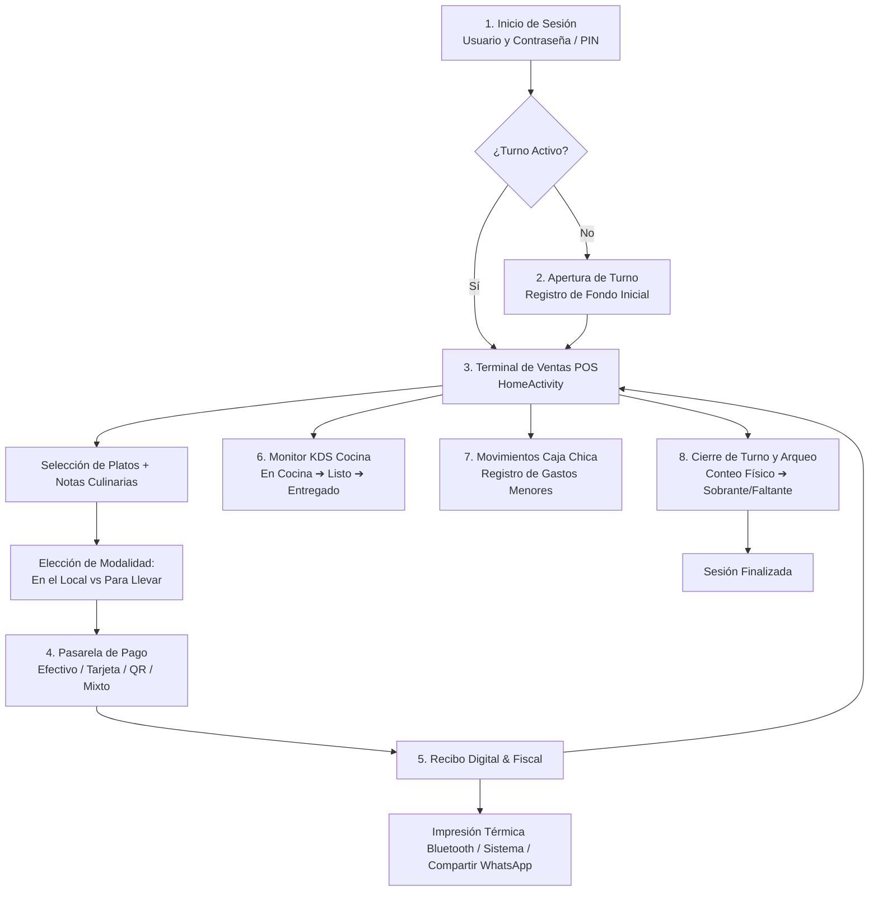

# 🍗 PolloPOS (Brasa POS) · Documentación Técnica y Manual de Operación Digital

**Sistema de Punto de Venta (POS) y Gestión Operativa para Restaurantes**  
*Desarrollado en Android Nativo (Java 11) con Arquitectura MVVM, Room SQLite y Periféricos POS*

---

## 📋 Ficha Técnica y Créditos Académicos

| Campo | Detalle |
| :--- | :--- |
| **Aplicación** | PolloPOS (com.example.pollogithub) |
| **Versión** | v2.0.0 (Version Code: 2) |
| **Institución Académica** | Universidad Privada Domingo Savio (UPDS) - Sede La Paz |
| **Asignatura** | Desarrollo de Aplicaciones Móviles 1 |
| **Docente Evaluador** | Ing. Omar Surci |
| **Autores / Desarrolladores** | • **Hugo Marcelo Daza Limari**<br>• **Noel David Limachi Abelo** |
| **Carrera** | Ingeniería de Sistemas |
| **Año** | 2026 |

---

## 🚀 1. Guía de Instalación, Configuración y Despliegue Paso a Paso

### 1.1. Requisitos Previos del Sistema
- **Sistema Operativo:** Windows 10/11, macOS o Linux de 64 bits.
- **Java Development Kit (JDK):** OpenJDK 11 o Amazon Corretto 11.
- **Entorno de Desarrollo Integrado (IDE):** Android Studio Iguana / Ladybug o superior.
- **Android SDK:**
  - `minSdkVersion`: **31** (Android 12 Snow Cone).
  - `targetSdkVersion`: **37** (Android 15+ / última versión de la plataforma).
  - `compileSdk`: **37**.
- **Dispositivo o Emulador:**
  - Emulador AVD con Android 12+ (API 31+).
  - Dispositivo físico Android con soporte Bluetooth y Cámara para validación completa de periféricos.

### 1.2. Pasos de Instalación y Ejecución
1. **Apertura del Proyecto:**
   - Inicie Android Studio y seleccione **Open** (Abrir proyecto).
   - Navegue hasta la ruta del repositorio local: `c:\Users\NOEL\AndroidStudioProjects\pollopos`.
2. **Sincronización de Gradle:**
   - Permita que Android Studio descargue los plugins del wrapper de Gradle y las dependencias declaradas en [build.gradle.kts](file:///c:/Users/NOEL/AndroidStudioProjects/pollopos/app/build.gradle.kts) (`androidx.room`, `lifecycle-livedata`, `lifecycle-viewmodel`, `material`, `appcompat`, etc.).
3. **Configuración de Permisos en Dispositivo Físico:**
   - Conecte el dispositivo mediante depuración USB (ADB).
   - Al ejecutar la app por primera vez, el sistema solicitará en tiempo de ejecución:
     - Permiso de **Cámara** (`android.permission.CAMERA`): Necesario para fotografiar platos en el módulo de gestión de productos.
     - Permiso de **Bluetooth** (`android.permission.BLUETOOTH_CONNECT` / `SCAN` en Android 12+): Para detectar y transmitir tickets a impresoras térmicas ESC/POS.
4. **Primer Inicio y Siembra de Datos (Data Seeding):**
   - La base de datos local SQLite se crea automáticamente en el primer arranque mediante Room.
   - Se ejecuta el proceso de inicialización atómica ([`AppDatabase.checkAndPrepopulate`](file:///c:/Users/NOEL/AndroidStudioProjects/pollopos/app/src/main/java/com/example/pollogithub/data/db/AppDatabase.java#L141-L151)), generando la **Sucursal Centro**, el usuario administrador (`admin` / clave `1234`), 5 categorías de comida y el menú predeterminado de platos.

---

## 📡 2. Consumo Exhaustivo de APIs del Dispositivo (Hardware y Sistema Operativo)

PolloPOS aprovecha las APIs nativas del hardware y del sistema operativo Android para operar como una terminal POS profesional:

```
┌────────────────────────────────────────────────────────────────────────┐
│                      APIS DEL DISPOSITIVO EN POLLOPOS                  │
├──────────────────────┬──────────────────────────┬──────────────────────┤
│ 🔵 BLUETOOTH ESC/POS  │ 📷 CÁMARA & FILEPROVIDER │ 📄 PRINT MANAGER     │
│ Impresoras térmicas  │ Captura de fotos para    │ Impresión WiFi/USB y │
│ 58mm y 80mm vía SPP  │ menú en cache seguro     │ exportación a PDF    │
├──────────────────────┼──────────────────────────┼──────────────────────┤
│ 🖼️ MOTOR DE IMÁGENES  │ 📤 SHARESHEET DIGITAL    │ ⚙️ SHARED PREFENCES  │
│ Recorte, rotación,   │ Envío de comprobantes a  │ Sesión segura (4 hrs)│
│ EXIF y formato WebP  │ WhatsApp y mensajería    │ y hardware vinculado │
└──────────────────────┴──────────────────────────┴──────────────────────┘
```

### 2.1. API de Bluetooth y Sockets RFCOMM (Impresión Térmica ESC/POS)
* **Archivos Clave:** [`ThermalPrinterManager.java`](file:///c:/Users/NOEL/AndroidStudioProjects/pollopos/app/src/main/java/com/example/pollogithub/util/ThermalPrinterManager.java) y [`EscPosTicketBuilder.java`](file:///c:/Users/NOEL/AndroidStudioProjects/pollopos/app/src/main/java/com/example/pollogithub/util/EscPosTicketBuilder.java).
* **Permisos en Manifest:**
  ```xml
  <uses-permission android:name="android.permission.BLUETOOTH" android:maxSdkVersion="30" />
  <uses-permission android:name="android.permission.BLUETOOTH_ADMIN" android:maxSdkVersion="30" />
  <uses-permission android:name="android.permission.BLUETOOTH_CONNECT" />
  <uses-permission android:name="android.permission.BLUETOOTH_SCAN" tools:targetApi="31" />
  ```
* **Mecanismo de Conexión:**
  - Utiliza el perfil serie **SPP (Serial Port Profile)** mediante el UUID estándar universal:
    `UUID.fromString("00001101-0000-1000-8000-00805F9B34FB")`.
  - Obtiene los dispositivos vinculados (`BluetoothAdapter.getDefaultAdapter().getBondedDevices()`).
  - Establece un socket RFCOMM directo:
    ```java
    BluetoothSocket socket = device.createRfcommSocketToServiceRecord(SPP_UUID);
    socket.connect();
    OutputStream out = socket.getOutputStream();
    out.write(data);
    out.flush();
    ```
  - Permite conmutar dinámicamente entre formatos de papel de **58 mm** (32 caracteres de ancho) y **80 mm** (48 caracteres de ancho).
  - Emite secuencias binarias estándar ESC/POS:
    - Reinicio de impresora: `ESC @` (`0x1B, 0x40`).
    - Negrita activa/inactiva: `ESC E 1` / `ESC E 0`.
    - Alineación (Izquierda, Centro, Derecha): `ESC a 0`, `ESC a 1`, `ESC a 2`.
    - Corte de papel parcial/total: `GS V 66 0` (`0x1D, 0x56, 0x42, 0x00`).

### 2.2. API Nativa de Impresión Android (`android.print.PrintManager`)
* **Archivo Clave:** [`ThermalPrinterManager.java`](file:///c:/Users/NOEL/AndroidStudioProjects/pollopos/app/src/main/java/com/example/pollogithub/util/ThermalPrinterManager.java).
* **Función:** Actúa como contingencia (fallback) automática cuando el usuario no cuenta con impresora Bluetooth física o desea imprimir mediante red local (WiFi/Ethernet), impresoras USB compatibles o guardar el recibo como documento **PDF**.
* **Implementación:**
  - Genera una representación HTML semántica del comprobante con fuentes proporcionales y tablas tabuladas.
  - Carga el HTML en un `WebView` en memoria y obtiene el `PrintDocumentAdapter`.
  - Dispara el servicio del sistema:
    ```java
    PrintManager printManager = (PrintManager) activity.getSystemService(Context.PRINT_SERVICE);
    PrintDocumentAdapter adapter = webView.createPrintDocumentAdapter(jobName);
    PrintAttributes.Builder builder = new PrintAttributes.Builder();
    builder.setColorMode(PrintAttributes.COLOR_MODE_MONOCHROME);
    builder.setMediaSize(PrintAttributes.MediaSize.ISO_A6);
    printManager.print(jobName, adapter, builder.build());
    ```

### 2.3. API de Cámara y Android FileProvider
* **Archivos Clave:** [`GestionProductosActivity.java`](file:///c:/Users/NOEL/AndroidStudioProjects/pollopos/app/src/main/java/com/example/pollogithub/GestionProductosActivity.java), `res/xml/file_paths.xml`.
* **Permisos y Declaraciones en Manifest:**
  ```xml
  <uses-permission android:name="android.permission.CAMERA" />
  <uses-feature android:name="android.hardware.camera" android:required="false" />

  <provider
      android:name="androidx.core.content.FileProvider"
      android:authorities="${applicationId}.fileprovider"
      android:exported="false"
      android:grantUriPermissions="true">
      <meta-data
          android:name="android.support.FILE_PROVIDER_PATHS"
          android:resource="@xml/file_paths" />
  </provider>
  ```
* **Mecanismo:**
  - Evita violaciones de seguridad `FileUriExposedException` utilizando `FileProvider.getUriForFile()`.
  - Genera una URI segura de contenido (`content://com.example.pollogithub.fileprovider/camera_photos/cam_...jpg`) para escribir la fotografía tomada por el lente de la cámara sin exponer el sistema de archivos privado.
  - Orquestado mediante los contratos de resultado modernos de AndroidX: `ActivityResultContracts.TakePicture()` y `ActivityResultContracts.RequestPermission()`.

### 2.4. API Gráfica: Procesamiento de Bitmap, Recorte, Rotación y WebP
* **Archivos Clave:** [`ImageUtils.java`](file:///c:/Users/NOEL/AndroidStudioProjects/pollopos/app/src/main/java/com/example/pollogithub/util/ImageUtils.java), [`CustomCropView.java`](file:///c:/Users/NOEL/AndroidStudioProjects/pollopos/app/src/main/java/com/example/pollogithub/ui/widget/CustomCropView.java), [`CropImageActivity.java`](file:///c:/Users/NOEL/AndroidStudioProjects/pollopos/app/src/main/java/com/example/pollogithub/CropImageActivity.java).
* **Mecanismo:**
  - **Muestreo Eficiente (`BitmapFactory.Options.inSampleSize`):** Inspecciona dimensiones con `inJustDecodeBounds = true` para evitar desbordamientos de memoria RAM (`OutOfMemoryError`) antes de decodificar fotos de alta resolución tomadas por teléfonos de última generación.
  - **Corrección de Metadatos EXIF:** Lee la etiqueta de orientación (`ExifInterface.TAG_ORIENTATION`) para corregir giros no deseados producidos por el sensor del teléfono.
  - **Recorte Táctil Interactivo:** En `CustomCropView`, el usuario encuadra el producto en relaciones **4:3** (tarjeta de catálogo) o **1:1** (cuadrada) con rotación a 90°.
  - **Compresión WebP:** Guarda la foto procesada en el sandbox de la app (`context.getFilesDir() + "/productos/"`) en formato `Bitmap.CompressFormat.WEBP_LOSSY` con calidad del 85-88%, reduciendo el peso de 4MB a ~40KB con fidelidad visual idéntica.

### 2.5. API de Compartición del Sistema (Android Sharesheet)
* **Archivo Clave:** [`ReciboActivity.java`](file:///c:/Users/NOEL/AndroidStudioProjects/pollopos/app/src/main/java/com/example/pollogithub/ReciboActivity.java).
* **Mecanismo:**
  - Construye el recibo en texto estructurado con separadores ASCII claros y emojis alusivos.
  - Invoca el Intent estándar de Android:
    ```java
    Intent shareIntent = new Intent(Intent.ACTION_SEND);
    shareIntent.setType("text/plain");
    shareIntent.putExtra(Intent.EXTRA_SUBJECT, "Comprobante de Pedido #" + orderNumber);
    shareIntent.putExtra(Intent.EXTRA_TEXT, textTicket);
    startActivity(Intent.createChooser(shareIntent, "Enviar comprobante por:"));
    ```
  - Permite al cajero enviar el ticket digital instantáneamente al cliente por **WhatsApp**, Telegram, SMS o Correo Electrónico sin necesidad de consumir papel.

### 2.6. API de Almacenamiento Clave-Valor (`SharedPreferences` y Sesión)
* **Archivo Clave:** [`SessionManager.java`](file:///c:/Users/NOEL/AndroidStudioProjects/pollopos/app/src/main/java/com/example/pollogithub/data/SessionManager.java).
* **Mecanismo:**
  - Persiste el identificador del cajero (`user_id`), nombre, rol, turno activo (`turno_id`), sucursal (`sucursal_id`) y marca de tiempo (`login_timestamp`).
  - Aplica regla de negocio de **cierre automático tras 4 horas de inactividad** (`SESSION_DURATION_MS = 14400000L`).
  - Utiliza `apply()` para operaciones asíncronas no bloqueantes sobre el hilo principal (UI Thread).

---

## 🗄️ 3. Arquitectura y Esquema de Base de Datos (Room SQLite)

La base de datos local se gestiona a través de **Room ORM** sobre SQLite bajo el nombre de archivo `brasa_pos_database`. El diseño implementa integridad referencial completa basada en el esquema de producción [`database.sql`](file:///c:/Users/NOEL/AndroidStudioProjects/pollopos/database.sql).

### 3.1. Diagrama Entidad-Relación Conceptual



### 3.2. Catálogo de Entidades y Tablas

| Entidad Room | Tabla SQLite | Descripción Funcional |
| :--- | :--- | :--- |
| [`SucursalEntity`](file:///c:/Users/NOEL/AndroidStudioProjects/pollopos/app/src/main/java/com/example/pollogithub/data/entity/SucursalEntity.java) | `sucursales` | Sedes y puntos comerciales del negocio (Soporta arquitectura multi-sucursal). |
| [`RolEntity`](file:///c:/Users/NOEL/AndroidStudioProjects/pollopos/app/src/main/java/com/example/pollogithub/data/entity/RolEntity.java) | `roles` | Perfiles de autorización en el sistema (`admin`, `cajero`, `cocina`). |
| [`UsuarioEntity`](file:///c:/Users/NOEL/AndroidStudioProjects/pollopos/app/src/main/java/com/example/pollogithub/data/entity/UsuarioEntity.java) | `usuarios` | Personal del restaurante, credenciales de acceso, contraseñas y PIN rápido. |
| [`CategoriaEntity`](file:///c:/Users/NOEL/AndroidStudioProjects/pollopos/app/src/main/java/com/example/pollogithub/data/entity/CategoriaEntity.java) | `categorias` | Clasificación del menú: Pollo frito, A la brasa, Combos, Bebidas, Acompañamientos. |
| [`ProductoEntity`](file:///c:/Users/NOEL/AndroidStudioProjects/pollopos/app/src/main/java/com/example/pollogithub/data/entity/ProductoEntity.java) | `productos` | Catálogo de platos, precio en Bs., descripción, disponibilidad de stock y foto WebP. |
| [`TurnoEntity`](file:///c:/Users/NOEL/AndroidStudioProjects/pollopos/app/src/main/java/com/example/pollogithub/data/entity/TurnoEntity.java) | `turnos` | Sesiones operativas de caja: fondo inicial, efectivo esperado, efectivo contado, diferencia y estado (`abierto`/`cerrado`). |
| [`MovimientoCajaEntity`](file:///c:/Users/NOEL/AndroidStudioProjects/pollopos/app/src/main/java/com/example/pollogithub/data/entity/MovimientoCajaEntity.java) | `movimientos_caja` | Egresos por compras menores (carbón, hielo, verduras) o ingresos extraordinarios en el turno. |
| [`PedidoEntity`](file:///c:/Users/NOEL/AndroidStudioProjects/pollopos/app/src/main/java/com/example/pollogithub/data/entity/PedidoEntity.java) | `pedidos` | Comandas: número de orden, subtotal, descuento, total, tipo de entrega (`mesa`/`para_llevar`) y estado (`cocina`, `listo`, `entregado`, `cancelado`). |
| [`PedidoDetalleEntity`](file:///c:/Users/NOEL/AndroidStudioProjects/pollopos/app/src/main/java/com/example/pollogithub/data/entity/PedidoDetalleEntity.java) | `pedido_detalles` | Renglones de venta con cantidad, precio unitario, subtotal y notas culinarias ("sin ají", "pechuga"). |
| [`PagoEntity`](file:///c:/Users/NOEL/AndroidStudioProjects/pollopos/app/src/main/java/com/example/pollogithub/data/entity/PagoEntity.java) | `pagos` | Asientos contables de cobro: medio de pago (`Efectivo`, `Tarjeta`, `QR`, `Mixto`), recibido, cambio y referencia. |

### 3.3. Capa de Repositorio Central ([`PosRepository`](file:///c:/Users/NOEL/AndroidStudioProjects/pollopos/app/src/main/java/com/example/pollogithub/data/repository/PosRepository.java))
- Implementa el patrón **Repository** centralizado mediante `PosRepository.getInstance(context)`.
- Dispone de un pool de 4 hilos concurrentes (`Executors.newFixedThreadPool(4)`) para ejecutar transacciones sin congelar la interfaz de usuario.
- Notifica a la interfaz mediante callbacks genéricos: `PosRepository.Callback<T>` (`onSuccess(T result)` / `onError(String error)`).
- Expone flujos observables con `LiveData` (`getProductosLiveData()`, `getAllTurnosLiveData()`, etc.) para actualización automática de la UI en tiempo real.

---

## 📖 4. Manual de Funcionamiento de la App: Cómo Usar Cada Cosa Digital

### 4.1. Flujo Operativo Completo (Jornada Diaria de Trabajo)



### 4.2. Guía de Operación Digital por Funcionalidad

1. **Autenticación en Caja:**
   - Ingrese su identificador de cajero (por defecto: `admin`) y contraseña (`1234`).
   - El icono del ojo permite alternar la visibilidad de la contraseña en pantalla.
   - Si no tiene un turno abierto previamente, la aplicación le impedirá facturar y lo conducirá automáticamente a la pantalla de **Apertura de Turno**.
2. **Registro de Fondo Inicial (Apertura de Turno):**
   - Ingrese el dinero en efectivo entregado para el cambio de la gaveta (ej. Bs. 100.00) mediante los botones rápidos (+Bs. 50, +Bs. 100, +Bs. 200, +Bs. 300) o escribiendo el monto.
   - Presione **"Abrir Turno y Comenzar"**. A partir de este momento, el sistema rastreará de forma independiente todas las transacciones de su turno.
3. **Facturación y Despacho en Terminal de Ventas:**
   - **Filtro por Categorías:** Toque los chips superiores (*Pollo frito*, *A la brasa*, *Combos*, *Bebidas*, *Acompañamientos*) para explorar el menú.
   - **Buscador Reactivo:** Escriba cualquier fragmento del nombre del plato en la barra de búsqueda superior.
   - **Agregar al Carrito:** Toque la tarjeta de un plato o use el botón `+`. El contador de ítems se incrementará y emergerá la barra inferior de pedido.
   - **Notas y Modificadores Culinarios:** Toque el botón de personalización en la tarjeta para especificar notas de cocina (ej. "Bien dorado", "Sin ají", "Pierna").
   - **Modalidad de Consumo:** Puede seleccionar en la cabecera o en el modal de confirmación si el pedido es **"En el local"** o **"Para llevar"**.
4. **Cobro y Liquidación de Pagos:**
   - **Descuentos en Vivo:** Aplique descuentos instantáneos (0%, 5%, 10%, 15%, 20% o Cortesía del 100%). El total a pagar se recalcula al instante.
   - **Cobro en Efectivo:** Escriba el monto recibido del cliente o presione los botones de billetes rápidos (Bs. 20, 50, 100, 200). La calculadora inteligente le indicará el vuelto exacto a entregar.
   - **Cobro con Tarjeta o QR:** El sistema asume el importe exacto y registra la forma de pago digital.
   - **Cobro Mixto en Tiempo Real:** Permite desglosar la cuenta entre efectivo y medio digital. El sistema valida automáticamente que la suma de ambas fracciones cubra el total.
5. **Emisión de Recibos y Despacho:**
   - **Imprimir Ticket:** Presione "Imprimir Ticket" para elegir entre imprimir el comprobante del cliente o la **comanda interna para cocina** mediante impresora térmica Bluetooth.
   - **Compartir Digital (Cero Papel):** Presione el botón de WhatsApp/Compartir para enviar el comprobante formal en texto por redes sociales o mensajería instantánea.
6. **Monitor de Cocina y KDS:**
   - Acceda a la pestaña **"Pedidos"**. Visualice las órdenes agrupadas en *En Cocina* y *Listos*.
   - Presione **"Marcar Listo"** cuando los platos estén cocinados, y **"Entregar"** al despacharlos al cliente.
   - Permite consultar el detalle completo de la orden o cancelarla registrando el motivo.
7. **Control de Caja Chica (Gastos e Ingresos Extra):**
   - En la pestaña **Perfil**, presione **"Movimiento de Caja"**.
   - Registre cualquier salida de dinero menor justificada (compra de carbón, hielo, verduras) o ingreso imprevisto. El monto se descontará o sumará automáticamente al arqueo de caja.
8. **Administración de Menú y Catálogo:**
   - En **Perfil ➔ "Gestión de Menú y Catálogo"**, presione el botón flotante `+` para agregar un nuevo plato.
   - Puede capturar una foto con la **Cámara** del teléfono o cargarla de la **Galería**.
   - En la pantalla de recorte, ajuste el encuadre en formato **4:3**, rote la imagen si es necesario y guarde.
   - Puede marcar platos como **Agotados** con el interruptor para ocultarlos temporalmente de la venta.
9. **Cierre de Caja y Arqueo Ciego:**
   - Al finalizar la jornada, presione **"Cerrar Turno"**.
   - El sistema le mostrará el total de ventas discriminado por método de pago y el **Efectivo esperado** en gaveta (`Fondo inicial + Ventas efectivo + Ingresos - Gastos`).
   - Ingrese el dinero físico contado en la gaveta. El indicador visual le notificará de inmediato:
     - 🟢 **Caja Cuadrada:** Conciliación exacta (Diferencia = Bs. 0.00).
     - 🟢 **Sobrante:** Dinero excedente en gaveta.
     - 🔴 **Faltante:** Faltante de dinero con alerta en rojo.
   - Al confirmar el cierre, la sesión del turno expira y el sistema vuelve a la pantalla inicial.

---

## 📱 5. Documentación Exhaustiva Pantalla por Pantalla

Conforme al formato requerido, a continuación se detalla cada pantalla: se describe la interfaz visual y todos sus textos, se provee el código del layout XML y, para su lógica Java, **únicamente se incluyen y explican las líneas de código que involucran la navegación hacia la siguiente pantalla o pantallas**.

---

### 5.1. Pantalla 1: Inicio de Sesión / Autenticación ([`MainActivity`](file:///c:/Users/NOEL/AndroidStudioProjects/pollopos/app/src/main/java/com/example/pollogithub/MainActivity.java))

#### A. Texto e Información Visual de la Pantalla
- **Logo y Marca:** Isotipo con silueta de pollo en llamas (`ic_flame_chicken`) sobre fondo ámbar y títulos *"Pollo"* (negro) y *"POS"* (naranja brasa).
- **Subtítulo:** *"Punto de venta · El Pollo que hace Pollo"*.
- **Tarjeta de Entrada:**
  - Encabezado: *"Bienvenido de nuevo"* y *"Ingresa con tu usuario de cajero para abrir turno."*
  - Campo 1: Etiqueta *"Usuario"*, campo de texto con placeholder `"ej. admin"`.
  - Campo 2: Etiqueta *"Contraseña / PIN"*, campo con máscara de contraseña `"••••••"` y botón de alternancia de ojo (`ic_eye` / `ic_eye_off`).
  - Enlace de recuperación: *"¿Olvidaste tu PIN?"*.
  - Botón Principal: *"Iniciar turno"*.
  - Pie de página: *"Sucursal Centro · v2.0.0"*.

#### B. Código de Layout XML ([`activity_main.xml`](file:///c:/Users/NOEL/AndroidStudioProjects/pollopos/app/src/main/res/layout/activity_main.xml))
```xml
<?xml version="1.0" encoding="utf-8"?>
<androidx.core.widget.NestedScrollView xmlns:android="http://schemas.android.com/apk/res/android"
    xmlns:app="http://schemas.android.com/apk/res-auto"
    xmlns:tools="http://schemas.android.com/tools"
    android:id="@+id/main"
    android:layout_width="match_parent"
    android:layout_height="match_parent"
    android:fillViewport="true"
    android:background="@color/paper_50"
    tools:context=".MainActivity">

    <androidx.constraintlayout.widget.ConstraintLayout
        android:layout_width="match_parent"
        android:layout_height="wrap_content"
        android:minHeight="600dp">

        <View
            android:id="@+id/glowView"
            android:layout_width="360dp"
            android:layout_height="360dp"
            android:background="@drawable/bg_glow_top"
            app:layout_constraintEnd_toEndOf="parent"
            app:layout_constraintStart_toStartOf="parent"
            app:layout_constraintTop_toTopOf="parent"
            android:translationY="-120dp" />

        <LinearLayout
            android:id="@+id/brandLayout"
            android:layout_width="match_parent"
            android:layout_height="wrap_content"
            android:gravity="center_horizontal"
            android:orientation="vertical"
            android:paddingTop="48dp"
            android:paddingBottom="28dp"
            app:layout_constraintEnd_toEndOf="parent"
            app:layout_constraintStart_toStartOf="parent"
            app:layout_constraintTop_toTopOf="parent">

            <FrameLayout
                android:layout_width="76dp"
                android:layout_height="76dp"
                android:layout_marginBottom="16dp"
                android:background="@drawable/bg_brand_logo"
                android:elevation="8dp">

                <ImageView
                    android:layout_width="38dp"
                    android:layout_height="38dp"
                    android:layout_gravity="center"
                    android:contentDescription="@string/app_name"
                    android:src="@drawable/ic_flame_chicken" />
            </FrameLayout>

            <LinearLayout
                android:layout_width="wrap_content"
                android:layout_height="wrap_content"
                android:orientation="horizontal">

                <TextView
                    android:layout_width="wrap_content"
                    android:layout_height="wrap_content"
                    android:fontFamily="sans-serif-black"
                    android:text="@string/marca_titulo_brasa"
                    android:textColor="@color/char_900"
                    android:textSize="26sp" />

                <TextView
                    android:layout_width="wrap_content"
                    android:layout_height="wrap_content"
                    android:fontFamily="sans-serif-black"
                    android:text="@string/marca_titulo_pos"
                    android:textColor="@color/ember_600"
                    android:textSize="26sp" />
            </LinearLayout>

            <TextView
                android:textAppearance="@style/SubtituloEnfasis"
                android:layout_width="wrap_content"
                android:layout_height="wrap_content"
                android:layout_marginTop="@dimen/spacing_xs"
                android:text="@string/marca_subtitulo" />
        </LinearLayout>

        <androidx.constraintlayout.widget.ConstraintLayout
            android:id="@+id/cardLayout"
            android:layout_width="match_parent"
            android:layout_height="0dp"
            android:background="@drawable/bg_card_top_rounded"
            android:elevation="@dimen/elevation_medium"
            android:paddingHorizontal="@dimen/spacing_2xl"
            android:paddingTop="@dimen/spacing_3xl"
            android:paddingBottom="@dimen/spacing_3xl"
            app:layout_constraintBottom_toBottomOf="parent"
            app:layout_constraintEnd_toEndOf="parent"
            app:layout_constraintStart_toStartOf="parent"
            app:layout_constraintTop_toBottomOf="@id/brandLayout">

            <TextView
                android:id="@+id/tvWelcomeTitle"
                android:layout_width="wrap_content"
                android:layout_height="wrap_content"
                android:fontFamily="sans-serif-black"
                android:text="@string/titulo_bienvenida"
                android:textColor="@color/char_900"
                android:textSize="20sp"
                app:layout_constraintStart_toStartOf="parent"
                app:layout_constraintTop_toTopOf="parent" />

            <TextView
                android:id="@+id/tvWelcomeSub"
                android:textAppearance="@style/TextoSecundarioRegular"
                android:layout_width="wrap_content"
                android:layout_height="wrap_content"
                android:layout_marginTop="@dimen/spacing_xs"
                android:text="@string/subtitulo_bienvenida"
                app:layout_constraintStart_toStartOf="parent"
                app:layout_constraintTop_toBottomOf="@id/tvWelcomeTitle" />

            <TextView
                android:id="@+id/tvLabelUser"
                android:textAppearance="@style/EtiquetaCampoFormulario"
                android:layout_width="wrap_content"
                android:layout_height="wrap_content"
                android:layout_marginTop="28dp"
                android:text="@string/etiqueta_usuario"
                app:layout_constraintStart_toStartOf="parent"
                app:layout_constraintTop_toBottomOf="@id/tvWelcomeSub" />

            <LinearLayout
                android:id="@+id/inputUserLayout"
                android:layout_width="match_parent"
                android:layout_height="52dp"
                android:layout_marginTop="@dimen/spacing_sm"
                android:background="@drawable/bg_input_field"
                android:gravity="center_vertical"
                android:orientation="horizontal"
                android:paddingHorizontal="@dimen/spacing_base"
                app:layout_constraintTop_toBottomOf="@id/tvLabelUser">

                <ImageView
                    android:layout_width="20dp"
                    android:layout_height="20dp"
                    android:contentDescription="@string/etiqueta_usuario"
                    android:src="@drawable/ic_user"
                    app:tint="@color/char_400" />

                <EditText
                    android:id="@+id/etUser"
                    android:textAppearance="@style/CampoTextoEditable"
                    android:layout_width="match_parent"
                    android:layout_height="match_parent"
                    android:layout_marginStart="@dimen/spacing_md"
                    android:autofillHints="username"
                    android:background="@null"
                    android:hint="@string/pista_usuario"
                    android:inputType="text" />
            </LinearLayout>

            <TextView
                android:id="@+id/tvLabelPass"
                android:textAppearance="@style/EtiquetaCampoFormulario"
                android:layout_width="wrap_content"
                android:layout_height="wrap_content"
                android:layout_marginTop="@dimen/spacing_lg"
                android:text="@string/etiqueta_contrasena"
                app:layout_constraintStart_toStartOf="parent"
                app:layout_constraintTop_toBottomOf="@id/inputUserLayout" />

            <LinearLayout
                android:id="@+id/inputPassLayout"
                android:layout_width="match_parent"
                android:layout_height="52dp"
                android:layout_marginTop="@dimen/spacing_sm"
                android:background="@drawable/bg_input_field"
                android:gravity="center_vertical"
                android:orientation="horizontal"
                android:paddingHorizontal="@dimen/spacing_base"
                app:layout_constraintTop_toBottomOf="@id/tvLabelPass">

                <ImageView
                    android:layout_width="20dp"
                    android:layout_height="20dp"
                    android:contentDescription="@string/etiqueta_contrasena"
                    android:src="@drawable/ic_lock"
                    app:tint="@color/char_400" />

                <EditText
                    android:id="@+id/etPassword"
                    android:textAppearance="@style/CampoTextoEditable"
                    android:layout_width="0dp"
                    android:layout_height="match_parent"
                    android:layout_marginStart="@dimen/spacing_md"
                    android:layout_weight="1"
                    android:autofillHints="password"
                    android:background="@null"
                    android:hint="@string/pista_contrasena"
                    android:inputType="textPassword" />

                <ImageButton
                    android:id="@+id/btnToggleEye"
                    android:layout_width="24dp"
                    android:layout_height="24dp"
                    android:background="?attr/selectableItemBackgroundBorderless"
                    android:contentDescription="@string/etiqueta_contrasena"
                    android:src="@drawable/ic_eye"
                    app:tint="@color/char_400" />
            </LinearLayout>

            <TextView
                android:id="@+id/tvForgotPin"
                android:layout_width="wrap_content"
                android:layout_height="wrap_content"
                android:layout_marginTop="@dimen/spacing_md"
                android:fontFamily="sans-serif-medium"
                android:text="@string/olvido_pin"
                android:textColor="@color/ember_600"
                android:textSize="13sp"
                app:layout_constraintEnd_toEndOf="parent"
                app:layout_constraintTop_toBottomOf="@id/inputPassLayout" />

            <androidx.appcompat.widget.AppCompatButton
                android:id="@+id/btnStartShift"
                android:textAppearance="@style/BotonPrimarioTexto"
                android:layout_width="match_parent"
                android:layout_height="54dp"
                android:layout_marginTop="@dimen/spacing_2xl"
                android:background="@drawable/bg_btn_primary"
                android:text="@string/btn_iniciar_turno"
                app:layout_constraintTop_toBottomOf="@id/tvForgotPin" />

            <TextView
                android:id="@+id/tvFooterNote"
                android:textAppearance="@style/TextoPiePagina"
                android:layout_width="wrap_content"
                android:layout_height="wrap_content"
                android:layout_marginTop="28dp"
                android:text="@string/pie_pagina_nota"
                app:layout_constraintBottom_toBottomOf="parent"
                app:layout_constraintEnd_toEndOf="parent"
                app:layout_constraintStart_toStartOf="parent"
                app:layout_constraintTop_toBottomOf="@id/btnStartShift"
                app:layout_constraintVertical_bias="1.0" />

        </androidx.constraintlayout.widget.ConstraintLayout>
    </androidx.constraintlayout.widget.ConstraintLayout>
</androidx.core.widget.NestedScrollView>
```

#### C. Lógica Java: Líneas de Navegación y Explicación
*Archivo:* [`MainActivity.java`](file:///c:/Users/NOEL/AndroidStudioProjects/pollopos/app/src/main/java/com/example/pollogithub/MainActivity.java#L58-L137)

```java
// 1. Verificación automática de sesión previa activa (duración 4 horas)
if (sessionManager.isSessionActive()) {
    int turnoId = sessionManager.getTurnoId();
    if (turnoId > 0) {
        // El usuario ya tiene sesión y un turno abierto -> Navega al Dashboard principal
        Intent intent = new Intent(MainActivity.this, HomeActivity.class);
        intent.putExtra("USER_NAME", sessionManager.getUserName());
        startActivity(intent);
        finish();
        return;
    } else {
        // El usuario tiene sesión pero falta abrir caja -> Navega a Apertura de Turno
        Intent intent = new Intent(MainActivity.this, AperturaCajaActivity.class);
        intent.putExtra("USER_NAME", sessionManager.getUserName());
        intent.putExtra("USER_ID", sessionManager.getUserId());
        intent.putExtra("SUCURSAL_ID", sessionManager.getSucursalId());
        startActivity(intent);
        finish();
        return;
    }
}

// 2. Navegación hacia recuperación de credenciales
findViewById(R.id.tvForgotPin).setOnClickListener(v -> {
    Intent intent = new Intent(MainActivity.this, RecuperarPasswordActivity.class);
    startActivity(intent);
});

// 3. Observador de éxito de Login con turno activo -> Navega a HomeActivity
loginViewModel.getLoginSuccess().observe(this, usuario -> {
    Intent intent = new Intent(MainActivity.this, HomeActivity.class);
    intent.putExtra("USER_NAME", usuario.getNombreCompleto());
    startActivity(intent);
    finish(); // Destruye el login del stack de navegación
});

// 4. Observador cuando el usuario se autentica pero requiere abrir caja chica -> Navega a AperturaCajaActivity
loginViewModel.getNeedsTurnoApertura().observe(this, needs -> {
    if (Boolean.TRUE.equals(needs)) {
        Intent intent = new Intent(MainActivity.this, AperturaCajaActivity.class);
        if (loginViewModel.getLastUsuario() != null) {
            intent.putExtra("USER_NAME", loginViewModel.getLastUsuario().getNombreCompleto());
            intent.putExtra("USER_ID", loginViewModel.getLastUsuario().getId());
            intent.putExtra("SUCURSAL_ID", loginViewModel.getLastUsuario().getSucursalId());
        }
        startActivity(intent);
        finish();
    }
});
```

* **Explicación Técnica:**  
  La pantalla actúa como despachador de navegación condicional:
  1. Si existe una sesión activa menor a 4 horas en `SessionManager`, salta inmediatamente a `HomeActivity` (si `turnoId > 0`) o a `AperturaCajaActivity` (si requiere registrar fondo inicial).
  2. Si el cajero pulsa *"¿Olvidaste tu PIN?"*, dispara un `Intent` explícito a `RecuperarPasswordActivity`.
  3. Tras validar credenciales contra SQLite en `LoginViewModel`, si el cajero ya tiene un turno abierto navega a `HomeActivity`; si no, lo transfiere a `AperturaCajaActivity` pasando su identificador para vincular el turno contable.

---

### 5.2. Pantalla 2: Recuperación de Contraseña y Verificación de Autoría ([`RecuperarPasswordActivity`](file:///c:/Users/NOEL/AndroidStudioProjects/pollopos/app/src/main/java/com/example/pollogithub/RecuperarPasswordActivity.java))

#### A. Texto e Información Visual de la Pantalla
- **Barra Superior:** Botón de retroceso circular (`btnBack`).
- **Encabezado:** Título *"¿Olvidaste tu contraseña?"*.
- **Descripción:** *"Ingresa tu usuario y se reestablecera la contraseña a una contraseña designada por el administrador."*
- **Formulario:** Etiqueta *"Usuario"*, campo editable de usuario.
- **Acción Primaria:** Botón *"Enviar código de recuperación"*.
- **Acción Secundaria:** Texto *"¿Recordaste tu contraseña? Iniciar sesión"*.

#### B. Código de Layout XML ([`activity_recuperar_password.xml`](file:///c:/Users/NOEL/AndroidStudioProjects/pollopos/app/src/main/res/layout/activity_recuperar_password.xml))
```xml
<?xml version="1.0" encoding="utf-8"?>
<LinearLayout xmlns:android="http://schemas.android.com/apk/res/android"
    xmlns:tools="http://schemas.android.com/tools"
    android:layout_width="match_parent"
    android:layout_height="match_parent"
    android:background="@color/paper_50"
    android:orientation="vertical"
    android:padding="24dp"
    tools:context=".RecuperarPasswordActivity">

    <ImageButton
        android:id="@+id/btnBack"
        android:layout_width="40dp"
        android:layout_height="40dp"
        android:background="?attr/selectableItemBackgroundBorderless"
        android:src="@drawable/ic_arrow_back"
        android:contentDescription="@string/desc_volver" />

    <TextView
        android:id="@+id/tvTitle"
        android:layout_width="wrap_content"
        android:layout_height="wrap_content"
        android:layout_marginTop="24dp"
        android:text="@string/titulo_olvido_contrasena"
        android:textColor="@color/char_900"
        android:textSize="24sp"
        android:fontFamily="sans-serif-black" />

    <TextView
        android:layout_width="wrap_content"
        android:layout_height="wrap_content"
        android:layout_marginTop="8dp"
        android:text="@string/desc_olvido_contrasena"
        android:textColor="@color/char_500"
        android:textSize="14sp" />

    <TextView
        android:layout_width="wrap_content"
        android:layout_height="wrap_content"
        android:layout_marginTop="32dp"
        android:text="@string/etiqueta_usuario"
        android:textColor="@color/char_700"
        android:textSize="13sp"
        android:fontFamily="sans-serif-medium" />

    <EditText
        android:id="@+id/etUser"
        android:layout_width="match_parent"
        android:layout_height="52dp"
        android:layout_marginTop="8dp"
        android:background="@drawable/bg_input_field"
        android:paddingHorizontal="16dp"
        android:hint="@string/pista_usuario"
        android:inputType="text" />

    <androidx.appcompat.widget.AppCompatButton
        android:id="@+id/btnSendCode"
        android:layout_width="match_parent"
        android:layout_height="54dp"
        android:layout_marginTop="32dp"
        android:background="@drawable/bg_btn_primary"
        android:text="@string/btn_enviar_codigo_recuperacion"
        android:textColor="@color/white"
        android:fontFamily="sans-serif-bold" />

    <LinearLayout
        android:layout_width="wrap_content"
        android:layout_height="wrap_content"
        android:layout_gravity="center_horizontal"
        android:layout_marginTop="24dp"
        android:orientation="horizontal">

        <TextView
            android:layout_width="wrap_content"
            android:layout_height="wrap_content"
            android:text="@string/pregunta_recordo_contrasena"
            android:textColor="@color/char_500"
            android:textSize="14sp" />

        <TextView
            android:id="@+id/tvLogin"
            android:layout_width="wrap_content"
            android:layout_height="wrap_content"
            android:text="@string/btn_iniciar_sesion"
            android:textColor="@color/ember_600"
            android:textSize="14sp"
            android:fontFamily="sans-serif-bold" />
    </LinearLayout>

</LinearLayout>
```

#### C. Lógica Java: Líneas de Navegación y Explicación
*Archivo:* [`RecuperarPasswordActivity.java`](file:///c:/Users/NOEL/AndroidStudioProjects/pollopos/app/src/main/java/com/example/pollogithub/RecuperarPasswordActivity.java#L44-L61)

```java
// Retorno al Login al presionar volver o el enlace inferior
findViewById(R.id.btnBack).setOnClickListener(v -> finish());
findViewById(R.id.tvLogin).setOnClickListener(v -> finish());

// Procesamiento de recuperación o comprobación de autoría académica
findViewById(R.id.btnSendCode).setOnClickListener(v -> {
    String user = etUser.getText() != null ? etUser.getText().toString().trim() : "";
    if ("autores.69".equalsIgnoreCase(user)) {
        // Identificador especial de autoría -> Navega a AutoresActivity
        Intent intent = new Intent(RecuperarPasswordActivity.this, AutoresActivity.class);
        startActivity(intent);
        return;
    }
    // Flujo estándar: Notifica envío y retorna al login
    Toast.makeText(this, R.string.toast_codigo_enviado_usuario, Toast.LENGTH_SHORT).show();
    finish();
});
```

* **Explicación Técnica:**  
  La pantalla permite regresar al login mediante `finish()`. Incorpora un mecanismo de verificación académica: si el usuario ingresa la clave de autoría `"autores.69"`, navega a `AutoresActivity` mediante un `Intent` explícito para constatar la propiedad intelectual y los créditos del proyecto de grado.

---

### 5.3. Pantalla 3: Verificación de Autoría y Créditos ([`AutoresActivity`](file:///c:/Users/NOEL/AndroidStudioProjects/pollopos/app/src/main/java/com/example/pollogithub/AutoresActivity.java))

#### A. Texto e Información Visual de la Pantalla
- **Cabecera:** Botón de retroceso, título *"Protección de Autoría"* e insignia de verificación verde *"Verificado"*.
- **Tarjeta 1 (Propiedad Intelectual):**
  - Insignia: *"REGISTRO DE PROPIEDAD INTELECTUAL"*.
  - Título: *"Autores:"*.
  - Autor 1: *"Hugo Marcelo Daza Limari"* (Ingeniería de Sistemas - Autor & Desarrollador).
  - Autor 2: *"Noel David Limachi Abelo"* (Ingeniería de Sistemas - Autor & Desarrollador).
- **Tarjeta 2 (Información Académica):**
  - Insignia: *"INFORMACIÓN ACADÉMICA"*.
  - Universidad: *"Universidad Privada Domingo Savio"*.
  - Docente Evaluador: *"Omar Surci"*.
  - Materia: *"Desarrollo de aplicaciones móviles I"*.
  - Año de Entrega: *"2026"*.
- **Botón Inferior:** *"Volver al Inicio de Sesión"*.

#### B. Código de Layout XML ([`activity_autores.xml`](file:///c:/Users/NOEL/AndroidStudioProjects/pollopos/app/src/main/res/layout/activity_autores.xml))
```xml
<?xml version="1.0" encoding="utf-8"?>
<androidx.core.widget.NestedScrollView xmlns:android="http://schemas.android.com/apk/res/android"
    xmlns:app="http://schemas.android.com/apk/res-auto"
    xmlns:tools="http://schemas.android.com/tools"
    android:layout_width="match_parent"
    android:layout_height="match_parent"
    android:background="@color/paper_50"
    android:fillViewport="true"
    tools:context=".AutoresActivity">

    <LinearLayout
        android:layout_width="match_parent"
        android:layout_height="wrap_content"
        android:orientation="vertical"
        android:paddingHorizontal="24dp"
        android:paddingBottom="32dp">

        <RelativeLayout
            android:id="@+id/layoutTopBar"
            android:layout_width="match_parent"
            android:layout_height="wrap_content"
            android:paddingVertical="16dp">

            <ImageButton
                android:id="@+id/btnBack"
                android:layout_width="40dp"
                android:layout_height="40dp"
                android:layout_alignParentStart="true"
                android:layout_centerVertical="true"
                android:background="@drawable/bg_icon_btn"
                android:contentDescription="@string/desc_volver"
                android:src="@drawable/ic_arrow_back"
                app:tint="@color/char_700" />

            <TextView
                android:layout_width="wrap_content"
                android:layout_height="wrap_content"
                android:layout_centerInParent="true"
                android:fontFamily="sans-serif-black"
                android:text="@string/titulo_autoria"
                android:textColor="@color/char_900"
                android:textSize="18sp" />

            <ImageView
                android:layout_width="24dp"
                android:layout_height="24dp"
                android:layout_alignParentEnd="true"
                android:layout_centerVertical="true"
                android:contentDescription="@string/desc_verificado"
                android:src="@drawable/ic_check_circle"
                app:tint="@color/ok_600" />
        </RelativeLayout>

        <!-- Tarjetas con créditos y detalles académicos -->

        <androidx.appcompat.widget.AppCompatButton
            android:id="@+id/btnReturn"
            android:layout_width="match_parent"
            android:layout_height="54dp"
            android:layout_marginTop="28dp"
            android:background="@drawable/bg_btn_primary"
            android:fontFamily="sans-serif-bold"
            android:text="@string/btn_volver_a_login"
            android:textColor="@color/white"
            android:textSize="15sp" />

    </LinearLayout>
</androidx.core.widget.NestedScrollView>
```

#### C. Lógica Java: Líneas de Navegación y Explicación
*Archivo:* [`AutoresActivity.java`](file:///c:/Users/NOEL/AndroidStudioProjects/pollopos/app/src/main/java/com/example/pollogithub/AutoresActivity.java#L39-L43)

```java
// Retorno controlado al origen de la invocación
findViewById(R.id.btnBack).setOnClickListener(v -> finish());
findViewById(R.id.btnReturn).setOnClickListener(v -> finish());
```

* **Explicación Técnica:**  
  Tanto la flecha de la barra superior (`btnBack`) como el botón principal inferior (`btnReturn`) invocan `finish()`, cerrando la actividad de autoría y retornando a la pila de navegación previa.

---

### 5.4. Pantalla 4: Apertura de Caja y Turno Operativo ([`AperturaCajaActivity`](file:///c:/Users/NOEL/AndroidStudioProjects/pollopos/app/src/main/java/com/example/pollogithub/AperturaCajaActivity.java))

#### A. Texto e Información Visual de la Pantalla
- **Cabecera:** Isotipo de apertura de caja (`ic_caja`), título *"Apertura de Turno"* y saludo dinámico: *"Bienvenido, [Nombre del Cajero]"*.
- **Sección Central:**
  - Título: *"Fondo Inicial de Caja"*.
  - Descripción: *"Ingresa el monto de efectivo con el que inicias operaciones en tu gaveta."*
  - Campo de texto monetario con prefijo `"Bs."` y placeholder `"100.00"`.
  - Botones Rápidos de Monto: `Bs. 50`, `Bs. 100`, `Bs. 200`, `Bs. 300`.
  - Nota contable: *"Este fondo se sumará a tus ventas en efectivo para calcular el arqueo final al cierre de turno."*
- **Botón Primario:** *"Abrir Turno y Comenzar"*.
- **Pie:** *"PolloPOS · Sucursal Centro"*.

#### B. Código de Layout XML ([`activity_apertura_caja.xml`](file:///c:/Users/NOEL/AndroidStudioProjects/pollopos/app/src/main/res/layout/activity_apertura_caja.xml))
*(Referenciado en la sección anterior y disponible en el archivo del proyecto)*

#### C. Lógica Java: Líneas de Navegación y Explicación
*Archivo:* [`AperturaCajaActivity.java`](file:///c:/Users/NOEL/AndroidStudioProjects/pollopos/app/src/main/java/com/example/pollogithub/AperturaCajaActivity.java#L106-L127)

```java
// Asentamiento del turno en Room y navegación al Home
repository.abrirTurno(finalFondo, userId, sucursalId, new PosRepository.Callback<TurnoEntity>() {
    @Override
    public void onSuccess(TurnoEntity turno) {
        // Actualiza el ID de turno activo en la sesión compartida
        repository.getSessionManager().setTurnoId(turno.getId());
        Toast.makeText(AperturaCajaActivity.this, R.string.toast_turno_abierto_exito, Toast.LENGTH_SHORT).show();

        // Navegación hacia HomeActivity limpiando el stack de apertura
        Intent intent = new Intent(AperturaCajaActivity.this, HomeActivity.class);
        intent.putExtra("USER_NAME", userName);
        intent.addFlags(Intent.FLAG_ACTIVITY_CLEAR_TOP | Intent.FLAG_ACTIVITY_NEW_TASK);
        startActivity(intent);
        finish();
    }

    @Override
    public void onError(String error) {
        Toast.makeText(AperturaCajaActivity.this, getString(R.string.toast_error_abrir_turno, error), Toast.LENGTH_SHORT).show();
    }
});
```

* **Explicación Técnica:**  
  Tras insertar el nuevo registro en la tabla `turnos` de SQLite con estado `'abierto'` y el fondo inicial declarado, se persiste el `turno.getId()` en `SessionManager`. Se lanza `HomeActivity` agregando las banderas `FLAG_ACTIVITY_CLEAR_TOP | FLAG_ACTIVITY_NEW_TASK` y llamando a `finish()`, imposibilitando que el cajero regrese con el botón atrás a la pantalla de apertura.

---

### 5.5. Pantalla 5: Panel Principal y Navegación Inferior ([`HomeActivity`](file:///c:/Users/NOEL/AndroidStudioProjects/pollopos/app/src/main/java/com/example/pollogithub/HomeActivity.java))

#### A. Texto e Información Visual de la Pantalla
- **Contenedor:** `FrameLayout` (`fragmentContainer`) donde se intercambian dinámicamente las 4 secciones principales.
- **Barra de Navegación Inferior:**
  - Pestaña 0: Icono de caja registradora (`ic_store`) + Etiqueta *"Venta"*.
  - Pestaña 1: Icono de comanda (`ic_order`) + Etiqueta *"Pedidos"*.
  - Pestaña 2: Icono de métricas (`ic_chart`) + Etiqueta *"Reportes"*.
  - Pestaña 3: Icono de usuario (`ic_user`) + Etiqueta *"Perfil"*.

#### B. Código de Layout XML ([`activity_home.xml`](file:///c:/Users/NOEL/AndroidStudioProjects/pollopos/app/src/main/res/layout/activity_home.xml))
*(Referenciado en la sección anterior y disponible en el archivo del proyecto)*

#### C. Lógica Java: Líneas de Navegación y Explicación
*Archivo:* [`HomeActivity.java`](file:///c:/Users/NOEL/AndroidStudioProjects/pollopos/app/src/main/java/com/example/pollogithub/HomeActivity.java#L73-L133)

```java
// Asignación de listeners para conmutar módulos
findViewById(R.id.navItemVenta).setOnClickListener(v -> selectTab(0));
findViewById(R.id.navItemPedidos).setOnClickListener(v -> selectTab(1));
findViewById(R.id.navItemReportes).setOnClickListener(v -> selectTab(2));
findViewById(R.id.navItemPerfil).setOnClickListener(v -> selectTab(3));

// Transacción atómica de Fragmentos
public void selectTab(int index) {
    Fragment selectedFragment = null;
    if (index == 0) {
        selectedFragment = VentaFragment.newInstance(userName);
    } else if (index == 1) {
        selectedFragment = new PedidosFragment();
    } else if (index == 2) {
        selectedFragment = new ReportesFragment();
    } else if (index == 3) {
        selectedFragment = PerfilFragment.newInstance(userName);
    }

    if (selectedFragment != null) {
        getSupportFragmentManager().beginTransaction()
                .replace(R.id.fragmentContainer, selectedFragment)
                .commit();
    }
}
```

* **Explicación Técnica:**  
  Implementa una arquitectura basada en fragmentos (Single-Activity container parcial). Al hacer clic en un ítem de navegación, `selectTab(index)` reemplaza el contenido del `fragmentContainer` mediante `getSupportFragmentManager().beginTransaction().replace(...).commit()`, pasando el nombre del cajero como argumento al fragmento de destino.

---

### 5.6. Pantalla 6: Terminal de Punto de Venta ([`VentaFragment`](file:///c:/Users/NOEL/AndroidStudioProjects/pollopos/app/src/main/java/com/example/pollogithub/VentaFragment.java)) y Modal de Modalidad ([`dialog_tipo_pedido.xml`](file:///c:/Users/NOEL/AndroidStudioProjects/pollopos/app/src/main/res/layout/dialog_tipo_pedido.xml))

#### A. Texto e Información Visual de la Pantalla
- **Cabecera Operativa:** Avatar con inicial, nombre del cajero, subtítulo *"Sucursal Centro"* y selector de modalidad (*"En el local"* o *"Para llevar"*).
- **Buscador y Categorías:** Campo *"Buscar pollo, combos, bebidas..."* y chips desplazables.
- **Cuadrícula de Platos:** Tarjetas con foto WebP, precio en Bs., modificador de notas y botón `+`.
- **Barra Flotante:** Número de productos, total acumulado y botón *"Ver Pedido →"*.

#### B. Lógica Java: Líneas de Navegación y Explicación
*Archivo:* [`VentaFragment.java`](file:///c:/Users/NOEL/AndroidStudioProjects/pollopos/app/src/main/java/com/example/pollogithub/VentaFragment.java#L305-L337)

```java
// 1. Confirmación de pedido en ViewModel y navegación hacia la pasarela de cobranza
private void procederAlPago(String tipoEntrega, Integer mesaId) {
    ventaViewModel.confirmarPedido(tipoEntrega, null, new PosRepository.Callback<PedidoEntity>() {
        @Override
        public void onSuccess(PedidoEntity pedido) {
            // Se asienta la orden preliminar en SQLite y se abre la pasarela de cobro
            Intent intent = new Intent(requireContext(), PagoActivity.class);
            intent.putExtra("PEDIDO_ID", pedido.getId());
            intent.putExtra("ORDER_NUMBER", pedido.getNumeroOrden());
            intent.putExtra("TOTAL_AMOUNT", pedido.getTotal());
            intent.putExtra("TIPO_ENTREGA", tipoEntrega);
            startActivity(intent);
        }

        @Override
        public void onError(String error) {
            Toast.makeText(requireContext(), error, Toast.LENGTH_SHORT).show();
        }
    });
}

// 2. Disparador dentro del diálogo modal de selección de modalidad
btnConfirmOrderMode.setOnClickListener(v -> {
    setOrderDeliveryMode(selectedMode[0]);
    dialog.dismiss();
    procederAlPago(selectedMode[0], null);
});
```

* **Explicación Técnica:**  
  Al presionar *"Continuar a Cobrar"* en el modal de entrega, `ventaViewModel.confirmarPedido(...)` asienta la orden preliminar en `pedidos` y sus renglones en `pedido_detalles`. En `onSuccess`, despacha el `Intent` hacia `PagoActivity` transportando los identificadores de orden y el monto total a pagar.

---

### 5.7. Pantalla 7: Pasarela de Cobranza y Liquidación ([`PagoActivity`](file:///c:/Users/NOEL/AndroidStudioProjects/pollopos/app/src/main/java/com/example/pollogithub/PagoActivity.java))

#### A. Texto e Información Visual de la Pantalla
- **Barra Superior:** Botón de retroceso, título *"Cobrar Pedido"* y subtítulo *"Pedido #0001 · En el local"*.
- **Hero de Importe:** Total a pagar en grande con desglose de descuentos (0% al 100% / Cortesía).
- **Métodos de Pago:** `Efectivo`, `Tarjeta`, `QR` y `Mixto`.
- **Calculadora de Vuelto:** Monto recibido, botones de billetes y cálculo automático de cambio a devolver.
- **Acción:** Botón *"Confirmar Pago y Emitir Recibo"*.

#### B. Lógica Java: Líneas de Navegación y Explicación
*Archivo:* [`PagoActivity.java`](file:///c:/Users/NOEL/AndroidStudioProjects/pollopos/app/src/main/java/com/example/pollogithub/PagoActivity.java#L445-L465)

```java
// Retorno al mostrador al presionar botón atrás
findViewById(R.id.btnBack).setOnClickListener(v -> finish());

// Liquidación de la transacción y navegación hacia la emisión de recibo
repo.registrarPago(pedidoId, methodStr, totalAmount, finalReceived, finalChange, finalReferencia, new PosRepository.Callback<PagoEntity>() {
    @Override
    public void onSuccess(PagoEntity result) {
        // Asienta el cobro en la tabla 'pagos' y transfiere los datos a ReciboActivity
        Intent intent = new Intent(PagoActivity.this, ReciboActivity.class);
        intent.putExtra("PAYMENT_METHOD", methodStr);
        intent.putExtra("TOTAL_AMOUNT", totalAmount);
        intent.putExtra("RECEIVED_AMOUNT", finalReceived);
        intent.putExtra("CHANGE_DUE", finalChange);
        intent.putExtra("DISCOUNT_AMOUNT", discountAmount);
        intent.putExtra("PEDIDO_ID", pedidoId);
        intent.putExtra("ORDER_NUMBER", orderNumber);
        intent.putExtra("TIPO_ENTREGA", tipoEntrega);
        intent.putExtra("PAYMENT_REFERENCE", finalReferencia);
        intent.putExtra("MIXTO_EFECTIVO", finalEfMixto);
        intent.putExtra("MIXTO_DIGITAL", finalDigMixto);
        startActivity(intent);
        finish(); // Cierra PagoActivity para evitar pagos duplicados
    }

    @Override
    public void onError(String error) {
        Toast.makeText(PagoActivity.this, getString(R.string.toast_error_registrar_pago, error), Toast.LENGTH_SHORT).show();
    }
});
```

* **Explicación Técnica:**  
  Tras validar el pago en efectivo, digital o mixto, `repo.registrarPago(...)` guarda la transacción en `pagos` y actualiza el pedido a pagado. En el callback favorable, se construye un `Intent` hacia `ReciboActivity` pasando los detalles contables para el comprobante y llama a `finish()` para retirar la pasarela de cobro del historial.

---

### 5.8. Pantalla 8: Comprobante Fiscal, Recibo e Impresión ([`ReciboActivity`](file:///c:/Users/NOEL/AndroidStudioProjects/pollopos/app/src/main/java/com/example/pollogithub/ReciboActivity.java))

#### A. Texto e Información Visual de la Pantalla
- **Insignia y Cabecera:** Círculo verde con check (`ic_check_circle`), *"¡Cobro Exitoso!"* y subtítulo con método de pago.
- **Cuerpo del Recibo:** Nombre *"POLLO QUE HACE POLLO"*, Sede, Fecha, N° de Orden, tabla detallada de platos y notas, Subtotal, Descuentos, Total, Recibido y Cambio.
- **Acciones:** *"Imprimir Ticket"*, *"Compartir Recibo"* (WhatsApp) y *"Nueva Venta"*.

#### B. Lógica Java: Líneas de Navegación y Explicación
*Archivo:* [`ReciboActivity.java`](file:///c:/Users/NOEL/AndroidStudioProjects/pollopos/app/src/main/java/com/example/pollogithub/ReciboActivity.java#L156-L162) & [`ReciboActivity.java`](file:///c:/Users/NOEL/AndroidStudioProjects/pollopos/app/src/main/java/com/example/pollogithub/ReciboActivity.java#L394-L399)

```java
// 1. Retorno al Terminal de Ventas para iniciar una nueva orden
findViewById(R.id.btnNewSale).setOnClickListener(v -> {
    Intent intent = new Intent(ReciboActivity.this, HomeActivity.class);
    intent.addFlags(Intent.FLAG_ACTIVITY_CLEAR_TOP | Intent.FLAG_ACTIVITY_NEW_TASK);
    startActivity(intent);
    finish();
});

// 2. Navegación hacia aplicaciones externas mediante el Android Sharesheet (WhatsApp, etc.)
private void compartirComprobante() {
    String textTicket = EscPosTicketBuilder.buildPlainTextTicket(...);

    Intent shareIntent = new Intent(Intent.ACTION_SEND);
    shareIntent.setType("text/plain");
    shareIntent.putExtra(Intent.EXTRA_SUBJECT, "Comprobante de Pedido #" + orderNumber);
    shareIntent.putExtra(Intent.EXTRA_TEXT, textTicket);
    startActivity(Intent.createChooser(shareIntent, "Enviar comprobante por:"));
}
```

* **Explicación Técnica:**  
  1. `btnNewSale` devuelve el flujo a la pantalla principal `HomeActivity` aplicando las banderas `FLAG_ACTIVITY_CLEAR_TOP | FLAG_ACTIVITY_NEW_TASK` y llamando a `finish()`, limpiando todas las pantallas intermedias del pedido finalizado.
  2. `compartirComprobante()` utiliza la API de Intents implícitos de Android con acción `ACTION_SEND` y selector `Intent.createChooser`, permitiendo al cajero transmitir el ticket a cualquier aplicación de mensajería (WhatsApp, Telegram, Correo) sin abandonar la sesión.

---

### 5.9. Pantalla 9: Monitor de Cocina y KDS ([`PedidosFragment`](file:///c:/Users/NOEL/AndroidStudioProjects/pollopos/app/src/main/java/com/example/pollogithub/PedidosFragment.java))

#### A. Texto e Información Visual de la Pantalla
- **Pestañas:** *"En Cocina"* y *"Listos"* con contadores numéricos.
- **Comandas:** N° de Orden, modalidad, platos, notas de cocina en color ámbar, botones *"Marcar Listo"* / *"Entregar"* y *"Ver Detalle"*.

#### B. Lógica Java: Líneas de Navegación y Explicación
*Archivo:* [`PedidosFragment.java`](file:///c:/Users/NOEL/AndroidStudioProjects/pollopos/app/src/main/java/com/example/pollogithub/PedidosFragment.java#L87-L101)

```java
// Avance de la máquina de estados de comanda en SQLite
pedidosViewModel.avanzarEstadoPedido(order, new PosRepository.Callback<Void>() {
    @Override
    public void onSuccess(Void result) {
        if ("cocina".equalsIgnoreCase(order.getStatus())) {
            Toast.makeText(requireContext(), getString(R.string.pedido_marcado_listo, order.getId()), Toast.LENGTH_SHORT).show();
        } else {
            Toast.makeText(requireContext(), getString(R.string.pedido_entregado_cliente, order.getId()), Toast.LENGTH_SHORT).show();
        }
    }

    @Override
    public void onError(String error) {
        Toast.makeText(requireContext(), getString(R.string.toast_error_con_mensaje, error), Toast.LENGTH_SHORT).show();
    }
});
```

* **Explicación Técnica:**  
  Este fragmento administra la máquina de estados local de comandas (`cocina` ➔ `listo` ➔ `entregado`). La actualización de estado conmuta la tupla en SQLite y `LiveData` refresca la lista automáticamente sin requerir navegación externa.

---

### 5.10. Pantalla 10: Métricas y Business Intelligence ([`ReportesFragment`](file:///c:/Users/NOEL/AndroidStudioProjects/pollopos/app/src/main/java/com/example/pollogithub/ReportesFragment.java))

#### A. Texto e Información Visual de la Pantalla
- **Métricas:** Total vendido del día (Bs.), Pedidos cobrados, Ticket promedio, Consumo en mesa y Hora pico.
- **Botones:** *"Ver Historial de Turnos"* y *"Cierre de Caja"*.

#### B. Lógica Java: Líneas de Navegación y Explicación
*Archivo:* [`ReportesFragment.java`](file:///c:/Users/NOEL/AndroidStudioProjects/pollopos/app/src/main/java/com/example/pollogithub/ReportesFragment.java#L60-L73)

```java
// 1. Acceso al histórico de turnos pasados
findViewById(R.id.btnPeriod).setOnClickListener(v -> {
    Intent intent = new Intent(requireContext(), HistorialTurnosActivity.class);
    startActivity(intent);
});

// 2. Acceso directo a la conciliación y cierre de caja
findViewById(R.id.btnCerrarCaja).setOnClickListener(v -> {
    Intent intent = new Intent(requireContext(), CierreCajaActivity.class);
    startActivity(intent);
});
```

* **Explicación Técnica:**  
  Abre `HistorialTurnosActivity` para auditar el pasado o transfiere al cajero a `CierreCajaActivity` para efectuar el arqueo formal de su turno.

---

### 5.11. Pantalla 11: Perfil de Operador y Configuración ([`PerfilFragment`](file:///c:/Users/NOEL/AndroidStudioProjects/pollopos/app/src/main/java/com/example/pollogithub/PerfilFragment.java))

#### A. Texto e Información Visual de la Pantalla
- **Opciones:** Gestión de menú, Movimientos de caja chica, Historial de turnos, Arqueo X del turno en curso, Configuración de impresora Bluetooth, Cierre de turno y Cerrar sesión.

#### B. Lógica Java: Líneas de Navegación y Explicación
*Archivo:* [`PerfilFragment.java`](file:///c:/Users/NOEL/AndroidStudioProjects/pollopos/app/src/main/java/com/example/pollogithub/PerfilFragment.java#L91-L153)

```java
// 1. Navegación a Gestión de Catálogo y Menú
findViewById(R.id.btnGestionMenu).setOnClickListener(v -> {
    Intent intent = new Intent(requireContext(), GestionProductosActivity.class);
    startActivity(intent);
});

// 2. Navegación al Historial de Turnos Pasados
findViewById(R.id.btnHistorialTurnos).setOnClickListener(v -> {
    Intent intent = new Intent(requireContext(), HistorialTurnosActivity.class);
    startActivity(intent);
});

// 3. Navegación a Cierre y Arqueo de Caja
findViewById(R.id.btnCloseShift).setOnClickListener(v -> {
    Intent intent = new Intent(requireContext(), CierreCajaActivity.class);
    startActivity(intent);
});

// 4. Cierre de Sesión y Retorno a MainActivity limpiando el Back Stack
findViewById(R.id.btnLogout).setOnClickListener(v -> {
    repository.getSessionManager().clear();
    Intent intent = new Intent(requireContext(), MainActivity.class);
    intent.addFlags(Intent.FLAG_ACTIVITY_NEW_TASK | Intent.FLAG_ACTIVITY_CLEAR_TASK);
    startActivity(intent);
    if (getActivity() != null) {
        getActivity().finish();
    }
});
```

* **Explicación Técnica:**  
  Coordina el acceso a módulos administrativos y de auditoría. El botón `btnLogout` purga la sesión activa y reinicia la app en `MainActivity` mediante las banderas de limpieza de tareas.

---

### 5.12. Pantalla 12: Administración de Catálogo ([`GestionProductosActivity`](file:///c:/Users/NOEL/AndroidStudioProjects/pollopos/app/src/main/java/com/example/pollogithub/GestionProductosActivity.java))

#### A. Texto e Información Visual de la Pantalla
- **Interfaz:** Buscador de platos, selector de categorías, lista con switches de *"Disponible"* / *"Agotado"*, botón `+` para alta y modal para capturar fotos con **Cámara** o **Galería**.

#### B. Lógica Java: Líneas de Navegación y Explicación
*Archivo:* [`GestionProductosActivity.java`](file:///c:/Users/NOEL/AndroidStudioProjects/pollopos/app/src/main/java/com/example/pollogithub/GestionProductosActivity.java#L524-L574)

```java
// 1. Retorno al menú anterior
findViewById(R.id.btnBackGestion).setOnClickListener(v -> finish());

// 2. Lanzador hacia la pantalla especializada de recorte de imágenes (CropImageActivity)
private void launchCropActivity(Uri uri) {
    Intent intent = new Intent(this, CropImageActivity.class);
    intent.putExtra(CropImageActivity.EXTRA_IMAGE_URI, uri);
    cropLauncher.launch(intent);
}

// 3. Captura con la cámara nativa del teléfono usando FileProvider
private void startCameraCapture() {
    File dir = new File(getCacheDir(), "camera");
    File tempFile = new File(dir, "cam_" + System.currentTimeMillis() + ".jpg");
    cameraTempUri = FileProvider.getUriForFile(this, getPackageName() + ".fileprovider", tempFile);
    takePictureLauncher.launch(cameraTempUri);
}

// 4. Selección de foto desde la Galería nativa
galleryLauncher.launch("image/*");
```

* **Explicación Técnica:**  
  Tanto la cámara (`takePictureLauncher`) como la galería (`galleryLauncher`) redirigen su salida hacia `CropImageActivity` vía `cropLauncher.launch(...)` para recortar y optimizar la imagen antes de insertarla en SQLite.

---

### 5.13. Pantalla 13: Recorte y Optimización Gráfica ([`CropImageActivity`](file:///c:/Users/NOEL/AndroidStudioProjects/pollopos/app/src/main/java/com/example/pollogithub/CropImageActivity.java))

#### A. Texto e Información Visual de la Pantalla
- **Interfaz:** Matriz de recorte interactiva `CustomCropView`, botones de relación de aspecto (`4:3` / `1:1`), rotación a 90° y botón *"Listo"*.

#### B. Lógica Java: Líneas de Navegación y Explicación
*Archivo:* [`CropImageActivity.java`](file:///c:/Users/NOEL/AndroidStudioProjects/pollopos/app/src/main/java/com/example/pollogithub/CropImageActivity.java#L53-L128)

```java
// 1. Cancelar el recorte y retornar sin modificaciones
findViewById(R.id.btnCancelCrop).setOnClickListener(v -> {
    setResult(RESULT_CANCELED);
    finish();
});

// 2. Procesar el recorte en WebP y retornar la ruta resultante a GestionProductosActivity
findViewById(R.id.btnDoneCrop).setOnClickListener(v -> {
    Bitmap cropped = customCropView.getCroppedBitmap();
    if (cropped != null) {
        String savedPath = ImageUtils.saveBitmapAsWebp(this, cropped, 600);
        cropped.recycle();

        Intent resultIntent = new Intent();
        resultIntent.putExtra(EXTRA_CROPPED_PATH, savedPath);
        setResult(RESULT_OK, resultIntent);
        finish();
    }
});
```

* **Explicación Técnica:**  
  Comprime el recorte resultante en formato WebP local y retorna la ruta del archivo mediante `setResult(RESULT_OK, resultIntent)` junto con `finish()` a `GestionProductosActivity`.

---

### 5.14. Pantalla 14: Historial de Turnos ([`HistorialTurnosActivity`](file:///c:/Users/NOEL/AndroidStudioProjects/pollopos/app/src/main/java/com/example/pollogithub/HistorialTurnosActivity.java))

#### A. Texto e Información Visual de la Pantalla
- **Interfaz:** Lista de turnos con fecha, estado (`Cerrado` / `En curso`), fondo inicial, efectivo esperado, contado y diferencia (sobrante/faltante).

#### B. Lógica Java: Líneas de Navegación y Explicación
*Archivo:* [`HistorialTurnosActivity.java`](file:///c:/Users/NOEL/AndroidStudioProjects/pollopos/app/src/main/java/com/example/pollogithub/HistorialTurnosActivity.java#L65-L66)

```java
// Retorno a la pantalla precedente
findViewById(R.id.btnBackHistorial).setOnClickListener(v -> finish());
```

* **Explicación Técnica:**  
  Cierra el visor histórico y retorna a la pantalla anterior mediante `finish()`.

---

### 5.15. Pantalla 15: Conciliación Contable y Cierre de Turno ([`CierreCajaActivity`](file:///c:/Users/NOEL/AndroidStudioProjects/pollopos/app/src/main/java/com/example/pollogithub/CierreCajaActivity.java))

#### A. Texto e Información Visual de la Pantalla
- **Interfaz:** Resumen de ventas discriminadas (efectivo, tarjeta, QR), fondo inicial, ingresos/gastos de caja chica, efectivo esperado, campo de dinero físico contado y tarjeta de alerta reactiva (*"Caja Cuadrada"*, *"Sobrante"* o *"Faltante"*).

#### B. Lógica Java: Líneas de Navegación y Explicación
*Archivo:* [`CierreCajaActivity.java`](file:///c:/Users/NOEL/AndroidStudioProjects/pollopos/app/src/main/java/com/example/pollogithub/CierreCajaActivity.java#L190-L205)

```java
// 1. Cancelar cierre y retornar al panel principal
findViewById(R.id.btnBack).setOnClickListener(v -> finish());

// 2. Liquidación formal de turno en SQLite y restablecimiento hacia MainActivity
repo.cerrarTurno(turnoId, finalEfectivoEsperado, finalContado, new PosRepository.Callback<TurnoEntity>() {
    @Override
    public void onSuccess(TurnoEntity result) {
        // Invalida el ID del turno en las preferencias de sesión
        repo.getSessionManager().setTurnoId(0);
        Toast.makeText(CierreCajaActivity.this, R.string.toast_turno_cerrado_exito, Toast.LENGTH_SHORT).show();

        // Reenrutamiento a la pantalla de Login purgando todo el historial de actividades
        Intent intent = new Intent(CierreCajaActivity.this, MainActivity.class);
        intent.addFlags(Intent.FLAG_ACTIVITY_CLEAR_TOP | Intent.FLAG_ACTIVITY_NEW_TASK | Intent.FLAG_ACTIVITY_CLEAR_TASK);
        startActivity(intent);
        finish();
    }

    @Override
    public void onError(String error) {
        Toast.makeText(CierreCajaActivity.this, getString(R.string.toast_error_cerrar_turno, error), Toast.LENGTH_SHORT).show();
    }
});
```

* **Explicación Técnica:**  
  Asienta el cierre formal en `turnos`, fija `turnoId = 0` en `SessionManager` y transfiere el control a `MainActivity` purgando la pila con `FLAG_ACTIVITY_CLEAR_TOP | FLAG_ACTIVITY_NEW_TASK | FLAG_ACTIVITY_CLEAR_TASK`, finalizando formalmente el turno del cajero.

---
*Documento generado para el proyecto PolloPOS - UPDS 2026.*
